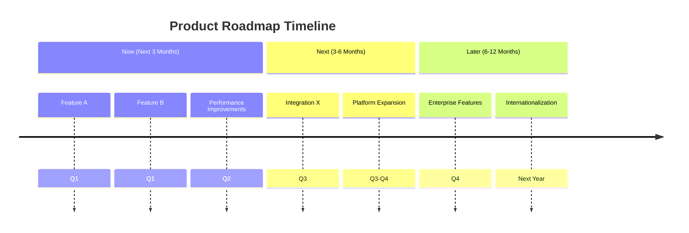

# Product Roadmap

## Product Vision
[Brief, inspiring statement about what this product will achieve in the long term.]

## Strategic Themes
*High-level focus areas for the product.*

1. **Theme 1:** [Strategic theme name]
   - **Objective:** [What we aim to achieve]
   - **Key Results:** [Measurable outcomes]

2. **Theme 2:** [Strategic theme name]
   - **Objective:** [What we aim to achieve]
   - **Key Results:** [Measurable outcomes]

3. **Theme 3:** [Strategic theme name]
   - **Objective:** [What we aim to achieve]
   - **Key Results:** [Measurable outcomes]

## Timeline Overview
*High-level view of major milestones and releases.*

## Detailed Roadmap

### Now (Next 3 Months)
*Features currently in development or planned for immediate delivery.*

| Feature/Initiative | Description | Target Date | Status | Owner |
|--------------------|-------------|-------------|--------|-------|
| **[Feature A]** | [Brief description] | YYYY-MM-DD | [Planned/In Progress] | [Owner] |
| **Key Outcomes:** | [What success looks like] | | | |
| **Dependencies:** | [What needs to be in place] | | | |
| **[Feature B]** | [Brief description] | YYYY-MM-DD | [Planned/In Progress] | [Owner] |
| **Key Outcomes:** | [What success looks like] | | | |
| **Dependencies:** | [What needs to be in place] | | | |

### Next (3-6 Months)
*Features planned for medium-term delivery.*

| Feature/Initiative | Description | Target Quarter | Confidence | Notes |
|--------------------|-------------|----------------|------------|-------|
| **[Feature C]** | [Brief description] | Q3 | High/Medium/Low | [Additional context] |
| **Business Value:** | [Why this matters] | | | |
| **Risks:** | [Potential challenges] | | | |
| **[Feature D]** | [Brief description] | Q3-Q4 | High/Medium/Low | [Additional context] |
| **Business Value:** | [Why this matters] | | | |
| **Risks:** | [Potential challenges] | | | |

### Later (6-12 Months)
*Longer-term ideas and opportunities.*

| Initiative | Description | Timeframe | Research Status |
|------------|-------------|-----------|----------------|
| **[Feature E]** | [Brief description] | 6-12 months | [Needs Validation/Validated] |
| **Market Potential:** | [Opportunity size] | | |
| **Feasibility:** | [Technical/business feasibility] | | |
| **[Feature F]** | [Brief description] | 6-12 months | [Needs Validation/Validated] |
| **Market Potential:** | [Opportunity size] | | |
| **Feasibility:** | [Technical/business feasibility] | | |

## Key Metrics & Goals
*How we'll measure success.*

### Business Metrics
| Metric | Current | Target (3 mo) | Target (6 mo) | Target (12 mo) |
|--------|---------|---------------|---------------|----------------|
| **Monthly Active Users (MAU)** | [Number] | [Target] | [Target] | [Target] |
| **Revenue** | [Amount] | [Target] | [Target] | [Target] |
| **Customer Satisfaction (CSAT)** | [Score] | [Target] | [Target] | [Target] |
| **Retention Rate** | [Percentage] | [Target] | [Target] | [Target] |

### Product Health Metrics
| Metric | Current | Target | Status |
|--------|---------|--------|--------|
| **Performance (Page Load Time)** | [Time] | [Target] | [Good/Warning/Poor] |
| **Error Rate** | [Percentage] | [Target] | [Good/Warning/Poor] |
| **Feature Usage** | [Percentage] | [Target] | [Good/Warning/Poor] |

## Dependencies & Risks

### External Dependencies
| Dependency | Type | Impact if Delayed | Contingency Plan |
|------------|------|-------------------|------------------|
| [Vendor API] | Technical | [Impact] | [Contingency] |
| [Regulatory Approval] | Compliance | [Impact] | [Contingency] |
| [Partner Integration] | Business | [Impact] | [Contingency] |

### Key Risks
| Risk | Probability | Impact | Mitigation Strategy |
|------|-------------|--------|-------------------|
| [Technical Risk] | High/Medium/Low | High/Medium/Low | [Mitigation] |
| [Market Risk] | High/Medium/Low | High/Medium/Low | [Mitigation] |
| [Resource Risk] | High/Medium/Low | High/Medium/Low | [Mitigation] |

## Resource Planning
*Team capacity and resource allocation.*

### Team Capacity
| Team | Current Capacity | Planned Changes | Notes |
|------|------------------|-----------------|-------|
| **Frontend** | [FTE count] | [Changes] | [Notes] |
| **Backend** | [FTE count] | [Changes] | [Notes] |
| **Design** | [FTE count] | [Changes] | [Notes] |
| **QA** | [FTE count] | [Changes] | [Notes] |

### Budget Considerations
| Category | Current Budget | Projected Needs | Variance |
|----------|----------------|-----------------|----------|
| **Development Tools** | [Amount] | [Amount] | [Variance] |
| **Third-party Services** | [Amount] | [Amount] | [Variance] |
| **Hosting/Infrastructure** | [Amount] | [Amount] | [Variance] |

## Assumptions & Constraints
### Key Assumptions
1. [Assumption about market conditions]
2. [Assumption about user behavior]
3. [Assumption about technology capabilities]

### Known Constraints
1. [Budget constraints]
2. [Timeline constraints]
3. [Technical constraints]

## Review & Update Process
### Roadmap Review Cadence
- **Monthly:** Team review and progress update
- **Quarterly:** Strategic review and reprioritization
- **Annually:** Long-term vision refresh

### Change Management
*Process for modifying the roadmap:*
1. Submit change request with justification
2. Review impact on existing commitments
3. Get stakeholder approval
4. Update documentation and communications

## Communication Plan
### Internal Communications
- **Weekly:** Team standups and progress updates
- **Monthly:** Stakeholder presentations
- **Quarterly:** All-hands roadmap review

### External Communications
- **Customers:** Release notes, webinar announcements
- **Partners:** Joint roadmap planning sessions
- **Public:** Blog posts, product updates

---

**Last Updated:** YYYY-MM-DD
**Next Review Date:** YYYY-MM-DD
**Document Owner:** [Product Manager Name]
**Approval Status:** [Draft/In Review/Approved]

---

## Appendix
### A. Feature Backlog
*Complete list of all considered features with prioritization.*

| Feature | Priority (P0-P3) | Effort (S/M/L/XL) | Value (H/M/L) | Notes |
|---------|------------------|-------------------|---------------|-------|
| [Feature] | [Priority] | [Effort] | [Value] | [Notes] |
| [Feature] | [Priority] | [Effort] | [Value] | [Notes] |

### B. Research & Validation Log
*Track of research conducted to validate roadmap items.*

| Item | Research Method | Date | Key Findings | Confidence Level |
|------|----------------|------|--------------|-----------------|
| [Feature] | [User Interviews] | YYYY-MM-DD | [Findings] | High/Medium/Low |
| [Feature] | [A/B Test] | YYYY-MM-DD | [Findings] | High/Medium/Low |

### C. Related Documents
- [Product Requirements Document]
- [Market Analysis]
- [Competitive Landscape]
- [User Research Summary]