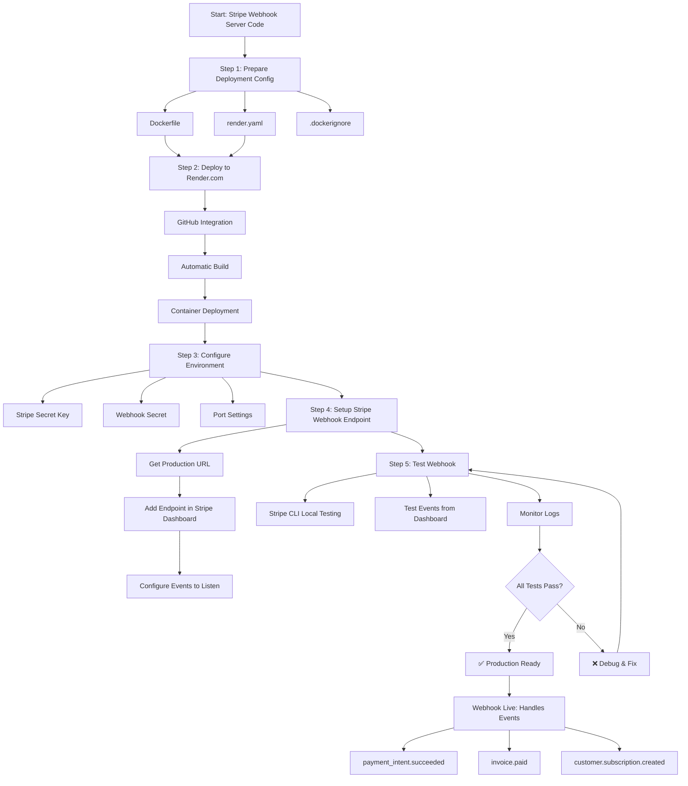
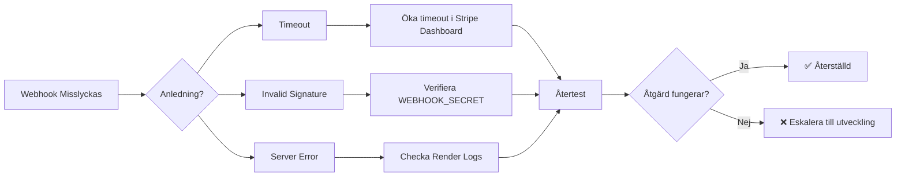
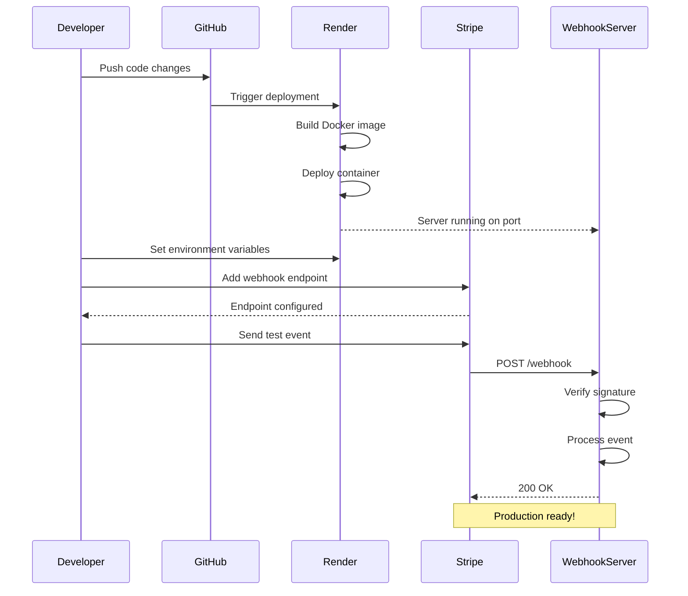

# Stripe Webhook Endpoint Deployment Flowchart



## Process Steg-för-Steg

### 1️⃣ Förberedelsefas
- **Dockerfile**: Definiera Go runtime, bygga och köra applikationen
- **render.yaml**: Konfiguration för Render.com deployment
- **.dockerignore**: Exkludera onödiga filer från Docker build

### 2️⃣ Deployment till Render.com
- **GitHub Integration**: Koppla repo till Render
- **Automatisk bygg**: Render bygger Docker image vid push
- **Container deployment**: Kör webhook server i container

### 3️⃣ Miljövariabler
- **STRIPE_SECRET_KEY**: Stripe API nyckel
- **WEBHOOK_SECRET**: Webhook signing secret
- **PORT**: Server port (default: 8080)

### 4️⃣ Stripe Dashboard Konfiguration
- **Hämta produktions-URL**: `https://your-app.onrender.com/webhook`
- **Lägg till endpoint**: Stripe Dashboard → Developers → Webhooks
- **Välj events**: Välj vilka Stripe events att lyssna på

### 5️⃣ Testning
- **Stripe CLI**: `stripe listen --forward-to localhost:8080/webhook`
- **Test events**: Skicka test events från Stripe Dashboard
- **Monitor logs**: Se svar och fel i Render loggar

### 6️⃣ Live
- **Hantera events**: Server svarar på Stripe webhook events
- **Logging**: Alla events loggas för debugging
- **Skalning**: Render hanterar trafik automatiskt

## Felhantering



## Checklista för Production Readiness

- [ ] Docker image byggs utan fel
- [ ] Container startar och lyssnar på port
- [ ] Miljövariabler är korrekt satta
- [ ] Webhook endpoint tillagd i Stripe
- [ ] Test events returnerar 200 OK
- [ ] Signaturverifiering fungerar
- [ ] Logging visar korrekta events
- [ ] Error handling är på plats
- [ ] Monitorering är konfigurerad

# ASCII Flowchart

```
┌─────────────────────────────────────────────────────────────┐
│                    START: CODEBASE                          │
└─────────────────────────────┬───────────────────────────────┘
                              │
                              ▼
┌─────────────────────────────────────────────────────────────┐
│          STEP 1: PREPARE DEPLOYMENT CONFIG                  │
│  ┌─────────────────┐ ┌─────────────────┐ ┌───────────────┐ │
│  │   Dockerfile    │ │   render.yaml   │ │ .dockerignore │ │
│  └─────────────────┘ └─────────────────┘ └───────────────┘ │
└─────────────────────────────┬───────────────────────────────┘
                              │
                              ▼
┌─────────────────────────────────────────────────────────────┐
│            STEP 2: DEPLOY TO RENDER.COM                     │
│  ┌────────────┐    ┌────────────┐    ┌──────────────────┐  │
│  │  GitHub    │───▶│  Auto-Build│───▶│ Container Deploy │  │
│  │ Integration│    │            │    │                  │  │
│  └────────────┘    └────────────┘    └──────────────────┘  │
└─────────────────────────────┬───────────────────────────────┘
                              │
                              ▼
┌─────────────────────────────────────────────────────────────┐
│        STEP 3: CONFIGURE ENVIRONMENT VARIABLES              │
│  ┌──────────────────┐ ┌────────────────┐ ┌──────────────┐  │
│  │ STRIPE_SECRET_KEY│ │ WEBHOOK_SECRET │ │    PORT      │  │
│  └──────────────────┘ └────────────────┘ └──────────────┘  │
└─────────────────────────────┬───────────────────────────────┘
                              │
                              ▼
┌─────────────────────────────────────────────────────────────┐
│      STEP 4: SETUP STRIPE WEBHOOK ENDPOINT                  │
│  ┌──────────────┐ ┌──────────────┐ ┌────────────────────┐  │
│  │ Get Prod URL │→│ Add to Dash- │→│ Configure Events   │  │
│  │              │ │ board        │ │                    │  │
│  └──────────────┘ └──────────────┘ └────────────────────┘  │
└─────────────────────────────┬───────────────────────────────┘
                              │
                              ▼
┌─────────────────────────────────────────────────────────────┐
│             STEP 5: TEST WEBHOOK                            │
│  ┌──────────────┐ ┌──────────────┐ ┌────────────────────┐  │
│  │ Stripe CLI   │ │ Test Events  │ │ Monitor Logs      │  │
│  │ Testing      │ │ from Dash-   │ │                   │  │
│  │              │ │ board        │ │                   │  │
│  └──────────────┘ └──────────────┘ └────────────────────┘  │
└─────────────────────────────┬───────────────────────────────┘
                              │
                      ┌───────┴───────┐
                      │               │
                      ▼               ▼
               ┌─────────────┐ ┌─────────────┐
               │  All Tests  │ │ Tests Fail  │
               │    PASS     │ │             │
               └──────┬──────┘ └──────┬──────┘
                      │               │
                      ▼               ▼
               ┌─────────────┐ ┌─────────────┐
               │ PRODUCTION  │ │  DEBUG &    │
               │   READY     │ │   RETEST    │
               └─────────────┘ └─────────────┘
```

## Sequence Diagram



## Nyckelkomponenter och Dependencies

```
┌─────────────┐    ┌─────────────┐    ┌─────────────┐
│   Stripe    │◄──►│  Webhook    │◄──►│   Render    │
│  Dashboard  │    │   Server    │    │    .com     │
└─────────────┘    └─────────────┘    └─────────────┘
        │                   │                   │
        │                   │                   │
        ▼                   ▼                   ▼
┌─────────────┐    ┌─────────────┐    ┌─────────────┐
│   Events    │    │    Go       │    │  Container  │
│ (payment_   │    │ Application │    │   Runtime   │
│  intent,    │    │             │    │             │
│  invoice)   │    └─────────────┘    └─────────────┘
└─────────────┘
```

Detta diagram visar hela flödet från kod till produktion, med alla steg som behövs för att få en Stripe webhook endpoint live och fungerande.