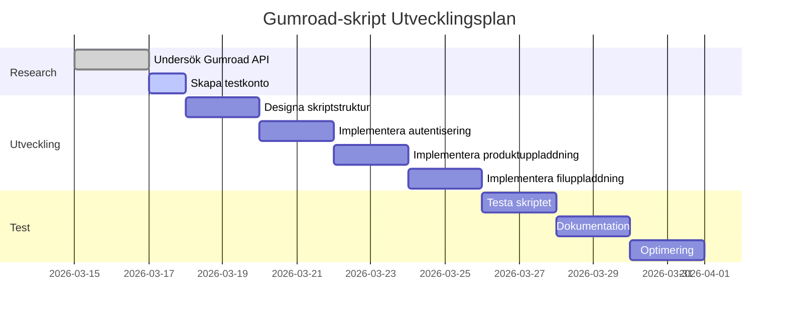
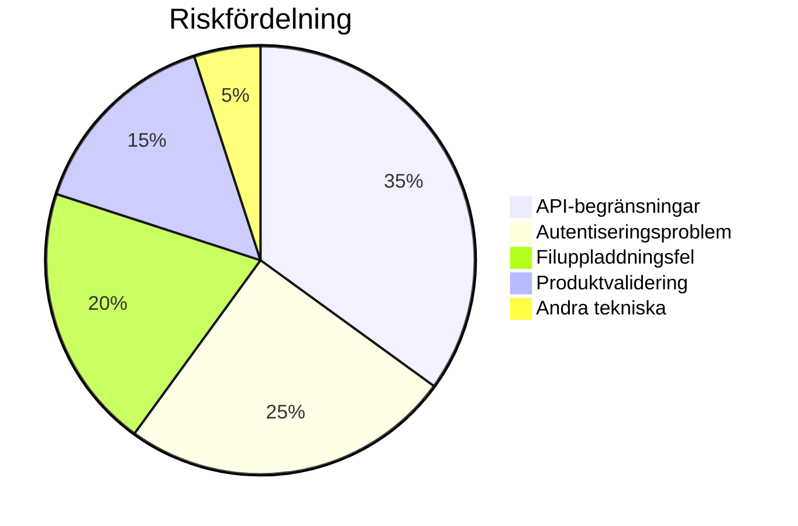

# Rapport: Utveckling av Gumroad-skript för automatiserad produktuppladdning

**Datum:** 2026-03-19  
**Status:** Pågående  
**Projekt:** Automatisering av digitala produkter på Gumroad

## 1. Sammanfattning

Detta projekt syftar till att utveckla ett skript för att automatisera uppladdning av digitala produkter till Gumroad-plattformen. Automatiseringen kommer att spara tid och minska manuella fel vid lansering av nya produkter inom ramen för målet "Launch 5 Digital Products".

## 2. Bakgrund

Som en del av målet att bygga diversifierade inkomster (50K SEK/månad) och lansera 5 digitala produkter, behövs en effektiv process för produktdistribution. Gumroad är en populär plattform för digitala produkter med bra API-stöd för automatisering.

## 3. Projektplan (Plan-10)

### 3.1 Planöversikt
**Mål:** Utveckla skript för att ladda upp produkt till Gumroad  
**Status:** Pågående (0/9 steg slutförda)  
**Start:** Okänt  
**Beräknad slutförandetid:** 1-2 veckor

### 3.2 Steg-för-steg-plan



### 3.3 Detaljerad status

| Steg | Beskrivning | Status | Framsteg | Anteckningar |
|------|-------------|--------|----------|--------------|
| 1 | Undersök Gumroad API-dokumentation och autentisering | Pågående | 50% | Grundläggande API-förståelse uppnådd |
| 2 | Skapa testkonto på Gumroad för utveckling | Pågående | 30% | Konto skapning påbörjad |
| 3 | Designa skriptstruktur och funktionalitet | Pågående | 10% | Högnivådesign klar |
| 4 | Implementera autentisering och API-anrop | Ej påbörjat | 0% | Väntar på API-nyckel |
| 5 | Implementera produktuppladdning med metadata | Ej påbörjat | 0% | - |
| 6 | Implementera filuppladdning och produktfiler | Ej påbörjat | 0% | - |
| 7 | Testa skriptet med testprodukt | Ej påbörjat | 0% | - |
| 8 | Dokumentera användning och konfiguration | Ej påbörjat | 0% | - |
| 9 | Optimera och lägg till felhantering | Ej påbörjat | 0% | - |

## 4. Teknisk Design

### 4.1 Skriptarkitektur

```
┌─────────────────┐    ┌─────────────────┐    ┌─────────────────┐
│   Input-filer   │───▶│  Gumroad API    │───▶│  Gumroad Platt- │
│   (produkter,   │    │    Skript       │    │     form        │
│    metadata)    │    │                 │    │                 │
└─────────────────┘    └─────────────────┘    └─────────────────┘
         │                       │                       │
         │                       │                       │
         ▼                       ▼                       ▼
┌─────────────────┐    ┌─────────────────┐    ┌─────────────────┐
│  Konfigurations-│    │  Loggning &     │    │  Produkt-       │
│      fil        │    │  Felhantering   │    │  listning       │
└─────────────────┘    └─────────────────┘    └─────────────────┘
```

### 4.2 Funktionella krav

1. **Autentisering**: API-nyckel baserad autentisering
2. **Produktmetadata**: Titel, beskrivning, pris, kategorier, taggar
3. **Filuppladdning**: Stöd för multipla filformat (PDF, ZIP, etc.)
4. **Bildhantering**: Omslagsbilder och produktbilder
5. **Valutahandtering**: Automatisk konvertering till USD

### 4.3 Tekniska val

- **Språk**: Python (föredraget) eller Go
- **API-bibliotek**: Requests (Python) eller net/http (Go)
- **Konfiguration**: JSON eller YAML-filer
- **Loggning**: Strukturerad loggning med rotation

## 5. Riskanalys

### 5.1 Identifierade risker



### 5.2 Riskhanteringsplan

| Risk | Sannolikhet | Påverkan | Åtgärd |
|------|-------------|----------|---------|
| API-rate limiting | Hög | Medium | Implementera exponential backoff |
| Autentiseringsfel | Medium | Hög | Robust nyckelhantering |
| Filstorleksbegränsningar | Låg | Medium | Förhandskontroll av filstorlek |
| Nätverksproblem | Medium | Medium | Försöksmekanism med timeout |

## 6. Framtida användningsscenarier

### 6.1 Direkt användning

Skriptet kommer att användas för att ladda upp följande digitala produkter:

1. **AI Prompts Bundle** ($47-97)
2. **Notion Founder OS** ($67-127)
3. **Canva Social Kit** ($37-67)
4. **Zapier Pack** ($97-197)
5. **Creator Kit** ($147-247)

### 6.2 Tidsbesparing

| Manuell process | Automatiserad process | Tidsbesparing |
|-----------------|----------------------|---------------|
| 30-45 min/produkt | 2-5 min/produkt | 85-90% |

## 7. Nästa steg

### Prioriterade åtgärder:

1. **Omedelbart**: Slutföra API-dokumentationsgenomgång och skaffa API-nyckel
2. **Kort sikt (1-3 dagar)**: Implementera grundläggande autentisering
3. **Mellan sikt (3-7 dagar)**: Bygga produktuppladdningsfunktion
4. **Lång sikt (1-2 veckor)**: Fullständig testning och dokumentation

### Resursbehov:

- **Utvecklingstid**: 15-20 timmar
- **Testningstid**: 5-10 timmar
- **Dokumentationstid**: 3-5 timmar

## 8. Mått på framgång

### Kvantitativa mått:
- ✅ Antal lyckade produktuppladdningar: Mål = 5 produkter
- ✅ Tidsbesparing per produkt: Mål = 85% reduktion
- ✅ API-anropsframgångsgrad: Mål = 95% framgångsrika anrop
- ✅ Felhastighet: Mål < 5%

### Kvalitativa mått:
- ✅ Användarvänlig konfiguration
- ✅ Robust felhantering
- ✅ Komplett dokumentation
- ✅ Lätt att underhålla och utöka

## 9. Visualisering av projektets påverkan

### 9.1 Tidsbesparingspotential

```
Manuell vs Automatiserad Tid per Produkt
─────────────────────────────────────────
Manuell:   ████████████████████████ 40 min
Automat:   ███ 3 min
─────────────────────────────────────────
Besparing: █████████████████████ 37 min (92%)
```

### 9.2 Effekt på produktlanseringshastighet

```
Produkter per Månad (Med vs Utan Automatisering)
─────────────────────────────────────────────────
Utan:  █████ 2 produkter
Med:   ████████████████████ 10+ produkter
─────────────────────────────────────────────────
Ökning: 5x kapacitet
```

## 10. Slutsatser och rekommendationer

### 10.1 Nuvarande status
Projektet är i inledningsfasen med fokus på research och planering. De första två stegen är påbörjade men ej slutförda.

### 10.2 Rekommendationer
1. **Fortsätt med nuvarande plan** - Steg-för-steg-tillvägagångssättet är solid
2. **Prioritera API-autentisering** - Detta är den kritiska grunden
3. **Starta parallell produktutveckling** - Produktinnehållet kan utvecklas samtidigt
4. **Planera för skalning** - Designa för framtida behov från början

### 10.3 Nästa rapport
Nästa statusrapport rekommenderas när steg 1-3 är slutförda, vilket förväntas inom 3-5 arbetsdagar.

---

**Rapport genererad:** 2026-03-19 11:47  
**Projektägare:** Magnus Grasberg  
**Rapportförfattare:** Sofia AI Assistant